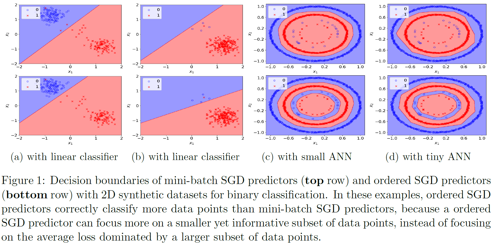
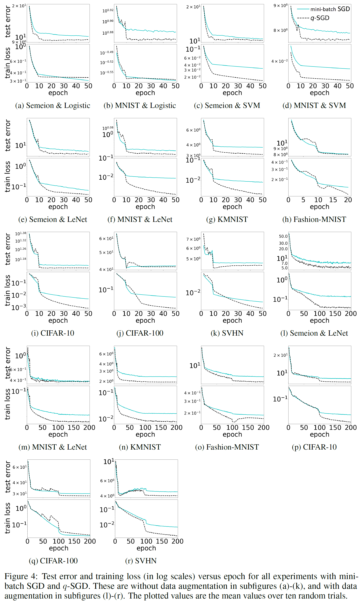
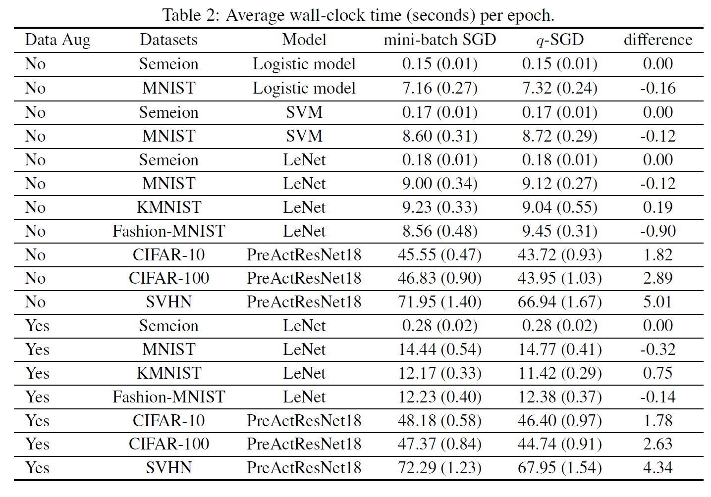

# q-SGD: a simple modification of SGD to accelerate training and improve test accuracy
This repo consists Pytorch code for "[A Stochastic First-Order Method for Ordered Empirical Risk Minimization](https://arxiv.org/abs/xxx)".

The proposed algorithm, q-SGD, **is fast (computationally efficient per epoch), is easy to be implemented, and comes with theoretical gurantees in both optimization and generalization**. Implementing q-SGD only requires modifications of one line or few lines in any code that uses SGD. The q-SGD algorithm accelerates training and improves test accuracy by focusing on the important data samples. The following figure illustrates the advantage of q-SGD in that q-SGD learns a different type of models than those learned by the standard SGD, which is often beneficial.

<p align="center">
    
</p>

As a result of the above mechanism (and other theoretical facts), q-SGD is fast and can improve test errors as shown in the following figure and tables:

CIFAR-10 with WideResNet28_10

| Method        |  test error |
| ------------- | ---------- |
| SGD           | 3.24%      |
| q-SGD         | 3.06%      |

<p align="center">
    
</p>

<p align="center">
    
</p>

If you find this useful in your research, please consider citing:

```
@article{qsgd2019,
        title = {A Stochastic First-Order Method for Ordered Empirical Risk Minimization},
       author = {Kawaguchi, Kenji and Haihao, Lu},
      journal = {arXiv preprint arXiv:XX},
         year = {2019}
}
```

In this paper, we propose a new stochastic first-order method for empirical risk minimization problems such as those that arise in machine learning. The traditional approaches, such as (mini-batch) stochastic gradient descent (SGD), utilize an unbiased gradient estimator of the empirical average loss. In contrast, we develop a computationally efficient method to construct a gradient estimator that is purposely biased toward those observations with higher current losses, and that itself is an unbiased gradient estimator of an ordered modification of the empirical average loss. On the theory side, we show that the proposed algorithm is guaranteed to converge at a sublinear rate to a global optimum for convex loss and to a critical point for non-convex loss. Furthermore, we prove a new generalization bound for the proposed algorithm. On the empirical side, we present extensive numerical experiments, in which our proposed method consistently improves the test errors compared with the standard mini-batch SGD in various models including SVM, logistic regression, and (non-convex) deep learning problems.

## How to modify your own code to use q-SGD

Implementing q-SGD only requires modifications of one line or few lines in any code that uses SGD. For example, in pytorch, suppose that you have the following lines:

```
loss = F.cross_entropy(model_output, y)
loss.backward()
optimizer.step() 
```
where 'optimizer' is the SGD optimizer. Then, you can implement q-SGD by simply re-writing these lines to the following lines:

```
loss = F.cross_entropy(model_output, y, reduction='none')
loss = torch.mean(torch.topk(loss, min(q, s), sorted=False, dim=0)[0]) 
loss.backward()
optimizer.step() 
```

where s is the mini-batch size (e.g., s = 64) and q is the hyper-parameter of q-SGD (e.g., q = 32). 

To avoid hyper-parameter search for the value of q, we used the following rule to automatically adjust q across all the experiments: q = s at the beginning of training, q = int(s/2) once train_acc >= 80%, q = int(s/4) once train_acc >= 90%, q = int(s/8) once train_acc >= 95%, and q = int(s/16) once train_acc >= 99:5%, where train_acc represents training accuracy.

```
if train_acc >= 99.5 and q > int(s/16):
    q = int(s/16)      
elif train_acc >= 95 and q > int(s/8):
    q = int(s/8)
elif train_acc >= 90 and q > int(s/4):
    q = int(s/4)  
elif train_acc >= 80 and q > int(s/2):
    q = int(s/2)           
```

## How to run this code 

### Examples for networks other than WideResNet28_10

##### Use the following commond in the root folder for training:

LeNet on MNIST via SGD without data augmentation:

```
python main.py --dataset=mnist --data-aug=0 --model=LeNet  --method=0
```    

LeNet on MNIST via q-SGD without data augmentation:

```
python main.py --dataset=mnist --data-aug=0 --model=LeNet  --method=1
```

LeNet on KMNIST via q-SGD with data augmentation:

```
python main.py --dataset=kmnist --data-aug=1 --model=LeNet  --method=1
```

LeNet on Fashion MNIST via q-SGD with data augmentation:

```
python main.py --dataset=fashionmnist --data-aug=1 --model=LeNet  --method=1
```

PreActResNet18 on CIFAR-10 via SGD without data augmentation:

```
python main.py --dataset=cifar10 --data-aug=0 --model=PreActResNet18 --method=0
```    

PreActResNet18 on CIFAR-10 via q-SGD without data augmentation：

```
python main.py --dataset=cifar10 --data-aug=0 --model=PreActResNet18 --method=1
```

PreActResNet18 on CIFAR-10 via SGD with data augmentation:

```
python main.py --dataset=cifar10 --data-aug=1 --model=PreActResNet18 --method=0
```    

PreActResNet18 on CIFAR-10 via q-SGD with data augmentation：

```
python main.py --dataset=cifar10 --data-aug=1 --model=PreActResNet18 --method=1
```

##### After training via both SGD and q-SGD, use the following commond in the root folder for plotting:

LeNet on MNIST without data augmentation:

```
python plot.py --dataset=mnist --data-aug=0 --model=LeNet
```

LeNet on MNIST with data augmentation:

```
python plot.py --dataset=mnist --data-aug=1 --model=LeNet
```

LeNet on KMNIST with data augmentation:

```
python plot.py --dataset=kmnist --data-aug=1 --model=LeNet
```

LeNet on Fashion MNIST with data augmentation:

```
python plot.py --dataset=fashionmnist --data-aug=1 --model=LeNet
```

PreActResNet18 on CIFAR-10 with data augmentation：

```
python plot.py --dataset=cifar10 --data-aug=1 --model=PreActResNet18
```

### WideResNet28_10

##### Use the following commond in folder 'cifar10_WideResNet':

for SGD:

```
python cifar.py --dataset cifar10 --p 0.5 --arch wrn --depth 28 --widen-factor 10 --schedule 100 200 --method=0 
```

for q-SGD:

```
python cifar.py --dataset cifar10 --p 0.5 --arch wrn --depth 28 --widen-factor 10 --schedule 100 200 --method=1 
```

Disclaimer: the code for WideResNet28_10 with CIFAR-10 is based on the code from random erasing repo: (https://github.com/zhunzhong07/Random-Erasing)

### This code has been tested with:
Python 3.6.7  
torch 1.0.1 
